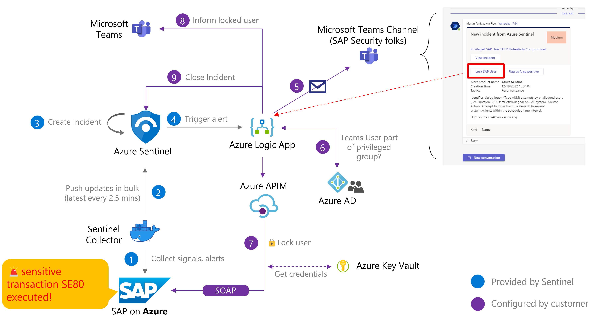

# The Scenario

**[🏠Home](../README.md)** - [ Quest 1 >](quest1.md)

Our journey will start from a sensitive transaction code - **SE80** - in the SAP backend. From there, your actions will be continuously audited by Microsoft Sentinel. SE80 is maintained on the Sentinel watchlist **SAP - Sensitive Transactions**. To be able to react on such suspicious activities, we will associate a **playbook** that will send an adaptive card to the SAP Security teams offering the option to immediately block the respective user on the SAP backend. The card will contain the details of the suspicious activity, the transaction, and the user details who executed it. The security administrator will then be able to take the appropriate action.

> **Note**:

>🏋🏽‍♂️**Difficulty meter** (1 star = walk in the park | 5 stars = squeeze your brains out ): 🌟🌟🌟🌟🌟

>⏱Allow ~1h to complete your journey once you got introduced to the scenario.

> **Warning**: The guide and screenshots refer to the English terms. We recommend to **adjust your browser language to English** to avoid confusion. Some of the translated texts can be misleading. For instance "Parse JSON" translates to "JSON analysieren" in German. The icons in Logic Apps etc. stay the same and can serve as visual reference if you get lost.

## Meet your Mentors, learn more about the journey and kick-off

🌟
🕒 15 mins

See the desired solution in action and put your mind to solving the challenge.

## [Quest 1](quest1.md): Novice's path

🌟
🕒 20 mins

Raise an incident in Microsoft Sentinel, investigate the incident details, and apply an automation rule

## [Quest 2](quest2.md): Apprentice's curious road

🌟🌟
🕒 10 mins

Understand the workflow and see the `SAP user blocking` in action

⏳Take a natural break here if suitable.

## [Quest 3](quest3.md): Debutant's journey

🌟🌟🌟
🕒 15 mins

Adjust the workflow blueprint to add the transaction code to the Microsoft Teams message

## [Quest 4](quest4.md): Master's trail

🌟
🕒 10 mins

Go all in and add Azure AD user locking

## Where to next?

**[🏠Home](../README.md)** - [ Quest 1 >](quest1.md)

[🔝](#)
