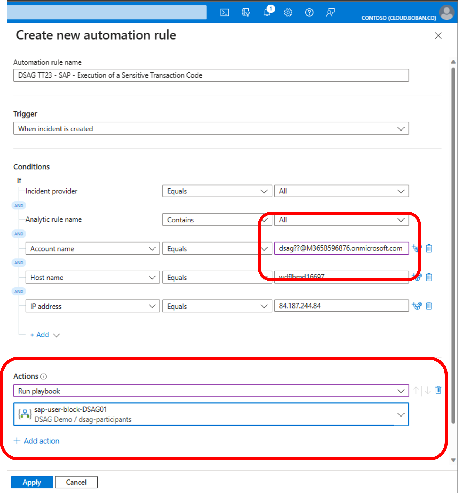

# Quest 1 - Novice's path

[< Quest 0](quest0.md) - **[🏠Home](../README.md)** - [ Quest 2 >](quest2.md)

🌟
🕒 20 mins

## Introduction

In this section we will raise an incident in Microsoft Sentinel by navigating to the "watched" transaction SE80 in SAP and investigate the incident details.

## The path

Use the [SAP WebGUI1](https://51.137.42.4:44300/sap/bc/gui/sap/its/webgui?sap-client=001&sap-language=EN) to connect to the provided SAP system with your given user (ignore certificate warning and proceed to the website). From the SAP Menu, select `Create Incident` which will start `SE80` and gets the scenario started. 

Incident collection runs every 5 minutes, so you will be investigating another recent incident till your own personal one arrives to familiarize yourself with the process.

> **Note**:
> 1 If you are familiar with the SAPGUI, you may connect using SID Q01, instance number 00, client 001 and app server IP 51.137.42.4 directly.

> **Warning**: some participants had restrictive browser settings in the past prohibiting access to a SAP CAL instance via SAP WebGUI with self-signed certificates. In case you encounter access issues please reach out to your mentor and discuss alternatives. We may trigger the transaction on behalf of your user as a last resort.

Find your way to the [shared Sentinel instance](https://portal.azure.com/?feature.customportal=false#view/Microsoft_Azure_Security_Insights/MainMenuBlade/~/6/id/%2Fsubscriptions%2F29198fb7-1044-4412-8cab-a054d04cb6f5%2Fresourcegroups%2Frg-demo-eunorth%2Fproviders%2Fmicrosoft.securityinsightsarg%2Fsentinel%2Fsen-demo-eunorth-001) using your given M365 user and navigate to the **Incidents** tab. You should see incident with id `1` raised by the SAP System `Q01`. Click on the incident (View full details) to see the details and identify which SAP user and which transaction caused it.

> **Note**:
> If you are getting a security error, make sure that you are in the right Azure Directory. Click on the your user symbol on the top right and click on `Switch directory`

On the line with `Contoso (cloud.boban.co)` click on Switch and try again. 

Can you learn anything from the description, evidence, and the related entities?

Can you find the latest update time for the SAP Audit Log?

Open the Connectors page (Configuration -> Data Connectors), click on the `Microsoft Sentinel for SAP` connector, and navigate from `Open Connector Page`.

Continue to the watchlist section under Configuration, identify the relevant list to learn which transaction codes are currently considered sensitive. Use the button `View in Logs` to expand values.

By now your own personal incident should have arrived. Navigate to it and select `Create Automation Rule`.

Choose your incident name, your SAP backend user name (e.g. DSAG01), and SID (Cloud App name) as condition for your rule. Finally add your playbook (or in other words Azure Logic App) under the "Actions" section. Your playbook has again your user name in the name.

This way only your individual interactions will be pushed to your personal workflow and Teams Channel.

> **Note** - Above screenshot shows the base flow used to create your playbook copies to isolate your work environment on this shared tenant used for the hands-on exercises.

Click apply.

## Where to next?

[< The Journey](quest0.md) - **[🏠Home](../README.md)** - [ Quest 2 >](quest2.md)

[🔝](#)
