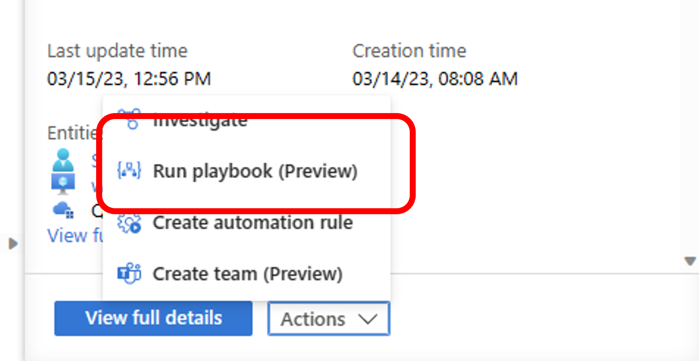
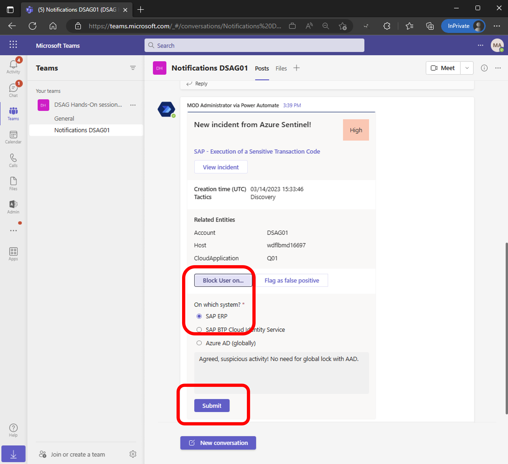
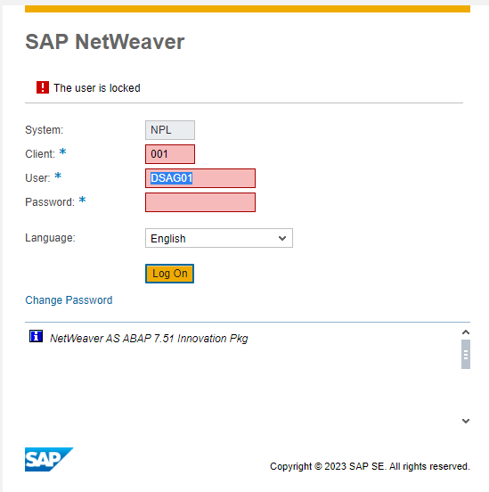

# Quest 2 - Apprentice's curious road

[< Quest 1](quest1.md) - **[🏠Home](../README.md)** - [ Quest 3 >](quest3.md)

🌟🌟
🕒 10 mins

## Introduction

In this section we will work with your playbook assigned to your "personal SAP incident" raised in Quest 1 to execute a workflow to inform the SAP security folks with an actionable alert in Microsoft Teams.

## The path

1. Navigate to the resource group [`rg-demo-eunorth`](https://portal.azure.com/#@cloud.boban.co/resource/subscriptions/29198fb7-1044-4412-8cab-a054d04cb6f5/resourceGroups/dsag-participants/overview) and find your Logic App (or in other words Sentinel playbook). The name contains your user name.

2. Familiarize yourself with the playbook and its various steps. Are you able to identify how the SAP user lock request is submitted to SAP?

3. Maintain the fourth flow step of the Logic App within the `Initialize SAP Security Admin email` action with your given M365 sandbox user (e.g. dsag01@M365B596876.onmicrosoft.com). Normally this customizing would be provided by Sentinel watchlists dynamically but for simplicity in this multi-tenant hands-on we are keeping it manual.

4. Open a new tab and navigate to [teams.microsoft.com](https://teams.microsoft.com/_#/conversations/General?threadId=19:KonRsOls_Pbe9OCeWzF68sAdhZURrmvq0i6CWLsRFWs1@thread.tacv2&ctx=channel), login with your given M365 sandbox user (e.g. dsag01@M365B596876.onmicrosoft.com) and find your Teams Channel within the team `DSAG Hands-On Session 1`. Your incident notifications from Sentinel will show up here.

5. In case your alert rule didn't trigger an execution yet, feel free to intentionally execute from the Sentinel Incident UI. Choose again Actions -> Run playbook.

6. Find the adaptive card posted to your Teams Channel and click on the `Lock SAP User` button.

> **Info** - Optionally see the [Outlook message](https://outlook.office.com/mail/) informing about and linking to the Microsoft Teams message.

7. You will see the adaptive card change. Shortly after a message from SAP will be posted as reply to your initial block request in the same Teams thread.

> **Info** - you may follow the detailed execution steps from your Logic App's `Runs history`. Navigate to the Overview pane and choose the ribbon 'Runs history'.

8. Verify that you locked the SAP backend user that caused the incident (yourself 😉 in this case) by trying to log in via the [SAP WebGUI](https://51.137.42.4:44300/sap/bc/gui/sap/its/webgui?sap-client=001&sap-language=EN). And don't worry we posted the unlock option via Teams too.

## Where to next?

[< Quest 1](quest1.md) - **[🏠Home](../README.md)** - [ Quest 3 >](quest3.md)

[🔝](#)
