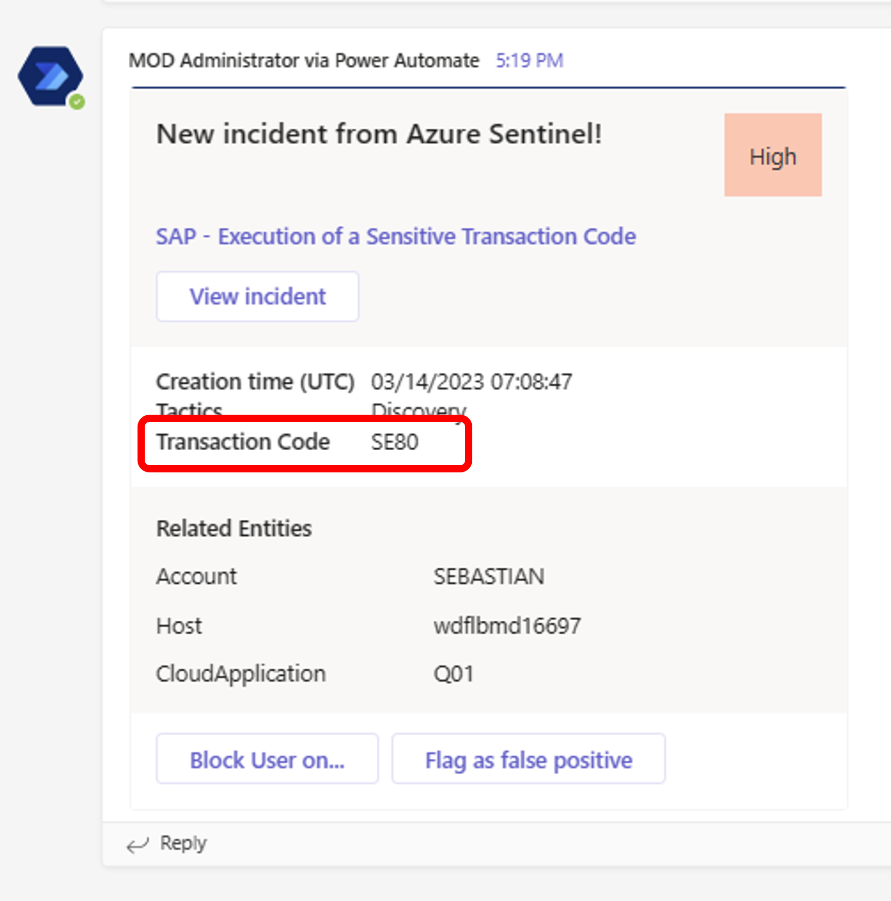

# Quest 3 - Debutant's journey

[< Quest 2](quest2.md) - **[🏠Home](../README.md)** - [ Quest 4 >](quest4.md)

🌟🌟🌟
🕒 15 mins

## Introduction

In this section we will tailor the playbook to our needs and adjust the properties of the adaptive card to include the SAP transaction code.

## The path

1. Check the incident details again on [Sentinel](https://portal.azure.com/#view/Microsoft_Azure_Security_Insights/MainMenuBlade/~/6/id/%2Fsubscriptions%2F29198fb7-1044-4412-8cab-a054d04cb6f5%2Fresourcegroups%2Frg-demo-eunorth%2Fproviders%2Fmicrosoft.securityinsightsarg%2Fsentinel%2Fsen-demo-eunorth-001). Which property contains the transaction code?

2. Use below snippet to add it to flow step `Post incident as adaptive card and wait for a response` on the Logic App. Scroll till you reach the JSON entity of "titel":"Tactics" and put your change as new JSON entity as **third FactSet** on the adaptive card.

```json
{
    "title": "Transaction Code",
    "value": "@{body('Parse_Incident_Custom_Details')?['TransactionCode'][0]}"
}
```

Either trigger the Logic App again from the Incident like you did before or choose a past run from the Logic App history and click `resubmit`. That is a nice practice during integration development to avoid waiting for new incidents during design time.

Your updated card on Teams should look like this:

<p align="center" width="100%">

</p>

Feel free to make further adjustments to the card in Microsoft Teams to your liking. The [adaptive card designer](https://adaptivecards.io/designer/) might be a great asset to help with that. Choose the Actionable Message flavour for Outlook and verify selected host app. See more useful references on the [start page](../README.md#handy-work).

> **Warning** - Microsoft Teams currently supports schema target version 1.4 but the latest adaptive card release is on 1.6 in preview.

## Where to next?

[< Quest 2](quest2.md) - **[🏠Home](../README.md)** - [ Quest 4 >](quest4.md)

[🔝](#)
